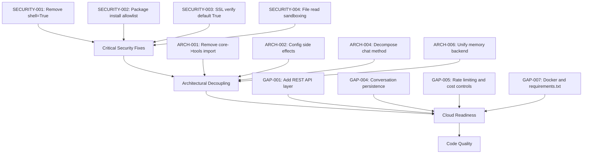

# Architecture Review: Basic Agent Framework

## Executive Summary

This is a well-structured ReAct-style autonomous agent framework with several genuinely clever design choices — particularly the dynamic plugin system, parallel tool execution, and token-aware context pruning. However, there are **critical security vulnerabilities**, **architectural coupling issues**, and **inconsistencies** that should be addressed before this framework is used for cloud-based specialized agents. Below is a detailed analysis organized by category.

---

## What Works Well

### 1. Dynamic Plugin System
The reflection-based tool discovery in [`main.py`](main.py:18) is elegant. Dropping a Python file into `tools/` and having it auto-register via `inspect.getmembers()` is a great developer experience. The `ModuleNotFoundError` catch-and-warn pattern (line 50) is thoughtful — it prevents a single missing dependency from crashing the entire agent.

### 2. Token-Aware Context Pruning
The [`_compress_history()`](core/agent.py:104) method is a practical solution to the context window problem. Summarizing older messages while preserving recent context is the right approach, and the 80% threshold trigger is sensible.

### 3. Parallel Tool Execution
Using `ThreadPoolExecutor` in the ReAct loop (line 515) to dispatch independent tool calls concurrently is a strong design choice that will meaningfully speed up multi-tool iterations.

### 4. Loop Detection
The `recent_tool_args` OrderedDict with signature-based deduplication (line 450-462) is a smart, lightweight way to prevent the agent from spinning in circles.

### 5. Session Telemetry
The [`SessionTelemetry`](core/telemetry.py:11) class is comprehensive — tracking tool usage, success rates, LLM token consumption, and RAG validation metrics. The manifest export provides excellent observability.

### 6. Pre/Post Hooks
The [`core/hooks.py`](core/hooks.py:1) interceptor pattern is clean and extensible. It gives agent builders a seam to inject custom logic without modifying the core loop.

---

## Critical Issues

### SECURITY-001: Arbitrary Command Execution — `shell=True`
**File:** [`tools/local_ops.py`](tools/local_ops.py:8)  
**Severity:** CRITICAL

```python
def execute_command(cmd: str, cwd: str = None, timeout: int = 60) -> str:
    result = subprocess.run(cmd, shell=True, capture_output=True, text=True, cwd=cwd, timeout=timeout)
```

`shell=True` with LLM-generated input is a **command injection vulnerability**. The agent can execute *any* command on the host system — `rm -rf /`, credential exfiltration, privilege escalation, etc. There is no sandboxing, no allowlist, and no approval gate.

**Recommendation:**
- Remove `shell=True` and use `subprocess.run(cmd.split(), ...)` for structured commands
- Implement a command allowlist/denylist in `core/hooks.py` via `pre_execute`
- Consider running commands in a Docker container or sandbox
- Add a human-approval gate for destructive operations (delete, overwrite, install)

### SECURITY-002: Arbitrary Package Installation
**File:** [`tools/python_ops.py`](tools/python_ops.py:6)  
**Severity:** HIGH

```python
def install_python_package(package_name: str) -> str:
    cmd = f"pip install {package_name}"
    return execute_command(cmd, timeout=120)
```

An LLM can install any package — including malicious ones. Combined with SECURITY-001, this is a full chain-of-compromise vector.

**Recommendation:** Add an allowlist of approved packages, or require operator confirmation before installing.

### SECURITY-003: SSL Verification Disabled
**File:** [`tools/web_ops.py`](tools/web_ops.py:54)  
**Severity:** HIGH

```python
response = executor.request(..., verify=False)
```

`verify=False` disables TLS certificate validation on all web requests. This enables MITM attacks and is also applied in the fuzzing tool.

**Recommendation:** Make SSL verification configurable per-request, defaulting to `True`. Only disable for explicit security testing scenarios with user consent.

### SECURITY-004: Arbitrary File Read
**File:** [`tools/local_ops.py`](tools/local_ops.py:30)  
**Severity:** MEDIUM

`cat_local_file()` accepts absolute paths, allowing the agent to read any file on the system (e.g., `/etc/passwd`, `~/.ssh/id_rsa`).

**Recommendation:** Restrict file access to the project directory or session directory. Validate paths against an allowlist of permitted directories.

---

## Architectural Issues

### ARCH-001: Circular Dependency — Core Imports Tools
**File:** [`core/agent.py`](core/agent.py:17)  
**Severity:** HIGH

```python
from tools.memory_ops import smart_search_learnings, record_learning
```

The core module directly imports from the tools layer. This creates a circular dependency: `main.py` loads tools → tools may import from core → core imports from tools. This breaks the intended plugin architecture where tools are supposed to be pluggable and interchangeable.

**Recommendation:** Remove this import. Instead, register `smart_search_learnings` and `record_learning` as skills via the plugin system, and call them through `self.skills['smart_search_learnings']()` in the agent loop. This keeps core truly independent of any specific tool.

### ARCH-002: Module-Level Side Effects in Config
**File:** [`core/config.py`](core/config.py:48)  
**Severity:** MEDIUM

```python
SESSION_ID = datetime.now().strftime('%Y%m%d_%H%M%S')
CURRENT_SESSION_DIR = os.path.join(SESSIONS_BASE, f"session_{SESSION_ID}")
os.makedirs(LOGS_DIR, exist_ok=True)
os.makedirs(SCRIPTS_DIR, exist_ok=True)
os.makedirs(MEMORY_DIR, exist_ok=True)
```

Directory creation and timestamp generation happen at **import time**. This means:
- Importing `core.config` in tests creates directories
- The session timestamp is frozen at import time, not at agent start
- Multiple agents in the same process share the same session

**Recommendation:** Move session initialization into an explicit `init_session()` function called from `main.py`.

### ARCH-003: Module-Level Clients in rag_ops
**File:** [`tools/rag_ops.py`](tools/rag_ops.py:14)  
**Severity:** MEDIUM

```python
rag_chroma_client = chromadb.PersistentClient(path=MEMORY_DIR)
rag_collection = rag_chroma_client.get_or_create_collection(name="knowledge_cache")
ollama_client = Client()
syntax_model = APP_CONFIG.get("agent", {}).get("default_model", "base-model:latest")
```

These initialize at import time, even if `rag_ops` is never used. This causes:
- Unnecessary ChromaDB locks when the module is loaded
- A hardcoded fallback model `base-model:latest` that doesn't exist in config
- Ollama client connection at import time (fails if Ollama isn't running)

**Recommendation:** Use lazy initialization — create clients inside functions or via a `get_rag_client()` factory.

### ARCH-004: Monolithic `chat()` Method
**File:** [`core/agent.py`](core/agent.py:270)  
**Severity:** MEDIUM

The [`chat()`](core/agent.py:270) method is ~340 lines with deeply nested logic. It handles:
- KB context injection
- LLM streaming with retry
- Tool call parsing
- Parallel tool execution
- Loop detection
- Debug mode
- Failure tracking
- Context pruning

**Recommendation:** Decompose into focused methods:
- `_inject_kb_context(user_input)`
- `_stream_llm_response()`
- `_execute_tool_calls(tool_calls)`
- `_handle_final_response(message)`

### ARCH-005: Hardcoded Context Limits Override Config
**File:** [`core/agent.py`](core/agent.py:307)  
**Severity:** LOW

```python
context_limit = 32768 if self.mode == "cloud" else 8192
```

This hardcodes context limits inside `chat()`, overriding the values already loaded from `config.json` via `APP_CONFIG`. The `_compress_history()` method correctly reads from config, but `chat()` ignores it.

**Recommendation:** Use `APP_CONFIG.get("agent", {}).get("context_limits", {}).get(self.mode, 8192)` consistently, or better, store it as `self.context_limit` in `__init__`.

### ARCH-006: Inconsistent Memory Architecture
**Severity:** MEDIUM

The README advertises "Persistent Vector DB Memory" but the actual implementation is inconsistent:
- [`memory_ops.py`](tools/memory_ops.py:1) uses a **flat JSON file** (`knowledge_base.json`) for `record_learning` and `smart_search_learnings`
- [`agent.py`](core/agent.py:54) uses **ChromaDB** for cloud mode memory queries
- [`rag_ops.py`](tools/rag_ops.py:14) uses a **separate ChromaDB collection** (`knowledge_cache`)

There are three different memory systems that don't interoperate.

**Recommendation:** Unify on ChromaDB as the single memory backend. `memory_ops.py` should use the same ChromaDB client/collection as the agent, not a flat JSON file.

---

## Design Gaps for Cloud-Based Agents

### GAP-001: No API Server / REST Interface
The framework is purely CLI-based. For cloud deployment, you need an HTTP API layer (FastAPI, Flask, etc.) to accept requests from external systems.

### GAP-002: No Authentication or Multi-Tenancy
There's no concept of users, API keys, or session isolation. A cloud agent serving multiple clients would need authentication and data isolation.

### GAP-003: No Async Support
The main loop is synchronous with `ThreadPoolExecutor` for tools. For a cloud service handling concurrent requests, you need `asyncio` throughout.

### GAP-004: No Conversation Persistence
`chat_history` is in-memory only. When the process restarts, all context is lost. For cloud agents, you need session persistence (Redis, database, or file-based).

### GAP-005: No Rate Limiting or Cost Controls
Cloud API calls have real costs. There's no rate limiting, token budgets, or cost estimation. A runaway agent loop could generate significant API charges.

### GAP-006: Hardcoded Cloud Endpoint
**File:** [`core/agent.py`](core/agent.py:48)
```python
self.client = Client(host="https://ollama.com", ...)
```
The Ollama cloud endpoint is hardcoded. For a cloud-agent framework, this should be configurable per deployment.

### GAP-007: No Containerization
No `Dockerfile`, `docker-compose.yml`, or `requirements.txt` / `pyproject.toml` for dependency management. Cloud deployment requires reproducible environments.

---

## Code Quality Issues

### CODE-001: Duplicate Comment
**File:** [`core/agent.py`](core/agent.py:432)
```python
# Process tool calls
# Process tool calls
```
Minor but indicates copy-paste.

### CODE-002: Thread Safety of Global Web Session
**File:** [`tools/web_ops.py`](tools/web_ops.py:15)
```python
GLOBAL_WEB_SESSION = requests.Session()
```
A mutable global `requests.Session` is shared across parallel tool executions. While `requests.Session` is somewhat thread-safe, cookie state mutations during concurrent requests could cause race conditions.

### CODE-003: Telemetry Only Partially Integrated
`record_command_execution()` is only called in `web_ops.py` and `reset_web_session()`. The majority of tools (`local_ops`, `memory_ops`, `python_ops`, `reporting_ops`) don't report telemetry, making the manifest incomplete.

**Recommendation:** Move telemetry recording into the `post_execute` hook in `core/hooks.py` so it applies to all tools automatically.

### CODE-004: Domain-Specific Tools in a Generic Framework
[`reporting_ops.py`](tools/reporting_ops.py:9) contains `generate_vuln_report()` with security-audit-specific fields (CVE, exploit steps, severity). [`web_ops.py`](tools/web_ops.py:80) contains `fuzz_web_endpoint()`. These are not generic tools — they belong in a specialized security-agent profile, not the base framework.

**Recommendation:** Move security-specific tools into a separate `tools/security/` directory or a dedicated agent profile. Keep the base framework tools generic.

### CODE-005: Token Estimation is Crude
**File:** [`core/agent.py`](core/agent.py:109)
```python
approx_tokens = total_chars / 4
```
Dividing character count by 4 is a very rough approximation. Different models use different tokenizers (BPE vs. unigram), and this can be off by 30-50%.

**Recommendation:** Use `tiktoken` for OpenAI-compatible models, or at minimum make the ratio configurable per model.

---

## Recommended Refactoring Priority



---

## Summary Table

| Category | Issue ID | Severity | Title |
|----------|----------|----------|-------|
| Security | SECURITY-001 | CRITICAL | Arbitrary command execution via shell=True |
| Security | SECURITY-002 | HIGH | Arbitrary pip package installation |
| Security | SECURITY-003 | HIGH | SSL verification disabled globally |
| Security | SECURITY-004 | MEDIUM | Arbitrary file read via absolute paths |
| Architecture | ARCH-001 | HIGH | Circular dependency: core imports tools |
| Architecture | ARCH-002 | MEDIUM | Module-level side effects in config |
| Architecture | ARCH-003 | MEDIUM | Module-level client initialization in rag_ops |
| Architecture | ARCH-004 | MEDIUM | Monolithic 340-line chat method |
| Architecture | ARCH-005 | LOW | Hardcoded context limits override config |
| Architecture | ARCH-006 | MEDIUM | Three inconsistent memory systems |
| Cloud Gaps | GAP-001 | HIGH | No REST API interface |
| Cloud Gaps | GAP-002 | HIGH | No auth or multi-tenancy |
| Cloud Gaps | GAP-003 | MEDIUM | No async support |
| Cloud Gaps | GAP-004 | MEDIUM | No conversation persistence |
| Cloud Gaps | GAP-005 | MEDIUM | No rate limiting or cost controls |
| Cloud Gaps | GAP-006 | LOW | Hardcoded cloud endpoint |
| Cloud Gaps | GAP-007 | MEDIUM | No containerization config |
| Code Quality | CODE-001 | LOW | Duplicate comment |
| Code Quality | CODE-002 | MEDIUM | Thread safety of global web session |
| Code Quality | CODE-003 | MEDIUM | Telemetry only partially integrated |
| Code Quality | CODE-004 | LOW | Domain-specific tools in generic framework |
| Code Quality | CODE-005 | LOW | Crude token estimation |

---

## Overall Assessment

The framework has a **solid conceptual foundation** — the ReAct loop, plugin system, and telemetry are well-conceived. The biggest risks are:

1. **Security**: The current tool set allows unrestricted system access, which is unacceptable for cloud deployment
2. **Coupling**: Core importing from tools breaks the plugin architecture and makes it hard to swap tools
3. **Cloud readiness**: Missing API layer, persistence, auth, and containerization

The path forward is to fix security first, then decouple core from tools, then add the cloud infrastructure layer. The plugin system and ReAct loop are worth building on — they just need the right guardrails.