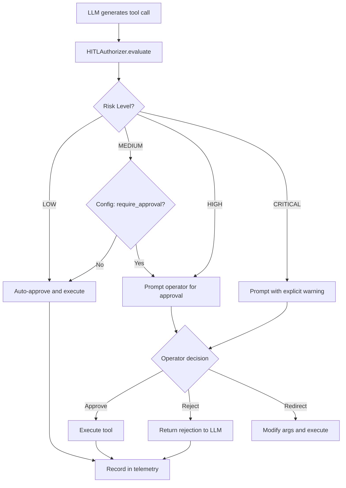

# HITL Authorization System — Design Document

## Overview

A Human-In-The-Loop (HITL) authorization layer that gates dangerous tool executions based on risk classification. Every tool call passes through the HITL system before execution. Low-risk operations auto-approve; high-risk operations require explicit human approval.

**Design Philosophy:** The agent retains full capability to perform any real-world action. HITL does NOT sandbox, restrict, or block capabilities — it ensures a human approves before dangerous operations execute. The human is the safety layer, not artificial constraints.

---

## Architecture



---

## Risk Classification

Each tool function is assigned a risk level based on its potential for harm:

| Risk Level | Description | Examples | Default Behavior |
|------------|-------------|----------|-------------------|
| **LOW** | Read-only, no side effects | `smart_search_learnings`, `cat_local_file` | Auto-approve |
| **MEDIUM** | Modifies local state, reversible | `save_to_local_file`, `record_learning`, `seed_knowledge_base`, `fetch_web_content` | Auto-approve (configurable) |
| **HIGH** | Executes commands, installs packages, network requests with SSL disabled | `execute_command`, `install_python_package`, `fetch_web_content` with `verify=False` | Require approval |
| **CRITICAL** | Destructive patterns, active security testing | `fuzz_web_endpoint`, commands with rm/del/format patterns | Require approval with warning |

### Classification Logic

Risk is determined by three layers, in priority order:

1. **Tool-level default** — Each tool function declares its risk via a decorator or registry
2. **Argument-level escalation** — Certain argument patterns escalate risk (e.g., `shell=True` patterns, `verify=False`, destructive keywords)
3. **Config-level overrides** — The operator can promote or demote tool risk levels in `config.json`

---

## New File: `core/hitl.py`

### Class: `HITLAuthorizer`

```python
class HITLAuthorizer:
    """Human-In-The-Loop authorization gate for tool executions."""
    
    def __init__(self, config: dict):
        self.risk_registry = {}        # tool_name -> RiskLevel
        self.approval_cache = {}       # args_signature -> decision (for session memory)
        self.config = config           # HITL config from config.json
        self.session_approvals = []    # audit log of all decisions
    
    def register_risk(self, tool_name: str, risk_level: str):
        """Register a tool's risk level. Called during plugin loading."""
        
    def evaluate(self, tool_name: str, args: dict) -> HITLDecision:
        """Evaluate a tool call and return a decision.
        - Checks tool risk level
        - Applies argument-level escalation rules
        - Returns AUTO_APPROVE, REQUIRE_APPROVAL, or BLOCKED
        """
        
    def request_approval(self, tool_name: str, args: dict, risk_level: str) -> str:
        """Interactive CLI prompt for operator approval.
        Returns: 'approve', 'reject', or redirect args string.
        """
        
    def check_auto_approved(self, tool_name: str, args: dict) -> bool:
        """Check if this exact tool+args combo was already approved this session."""
```

### Class: `HITLDecision`

```python
class HITLDecision:
    action: str          # "auto_approve" or "require_approval" — never "blocked"
    risk_level: str      # "low", "medium", "high", "critical"
    reason: str          # Human-readable explanation
    escalated: bool      # Whether args caused escalation from base risk
```

**Note:** There is no "blocked" action. The agent can do anything — HITL just ensures a human approves first for risky operations.

---

## Integration Points

### 1. Plugin Loading — `main.py`

During `load_plugins()`, after registering each skill, also register its risk level:

```python
# In load_plugins(), after agent.register_skill():
risk_level = getattr(func, '_hitl_risk', None)  # Check for decorator
if not risk_level:
    risk_level = classify_default_risk(func)      # Fallback heuristic
agent.hitl.register_risk(name, risk_level)
```

### 2. Tool Execution Loop — `core/agent.py`

Replace the current debug-mode approval block (lines 465-487) with HITL evaluation:

```python
# BEFORE executing any tool call:
decision = self.hitl.evaluate(func_name, args)

if decision.action == "auto_approve":
    # Execute immediately — no human needed
    pass
elif decision.action == "require_approval":
    approval = self.hitl.request_approval(func_name, args, decision.risk_level)
    if approval == "reject":
        # Operator rejected — tell LLM to try a different approach
        self.chat_history.append({
            'role': 'tool', 'name': func_name,
            'content': f"Operator rejected this action. Try a different approach."
        })
        continue
    elif approval.startswith("redirect:"):
        # Operator modified the args — use their version
        args = parse_redirect(approval)
# No "blocked" action — the agent can do anything, HITL just asks first
```

### 3. Risk Decorator — Optional for Plugin Authors

Plugin authors can explicitly declare risk:

```python
from core.hitl import hitl_risk, RiskLevel

@hitl_risk(RiskLevel.HIGH)
def execute_command(cmd: str, cwd: str = None, timeout: int = 60) -> str:
    """Run local command."""
    ...
```

### 4. Argument-Level Escalation Rules

Built-in rules that promote risk based on argument content:

```python
ESCALATION_RULES = {
    "execute_command": {
        "keywords": {
            "rm ", "del ", "rmdir", "format", "mkfs", "dd ", "shutdown",
            "reboot", ":(){ :|:& };:", "wget", "curl.*|.*sh",
            "chmod 777", "chown", "passwd", "useradd", "usermod"
        },
        "escalate_to": "critical"  # Prompts operator, does NOT block
    },
    "install_python_package": {
        "always_escalate_to": "high"  # Any pip install needs approval
    },
    "fetch_web_content": {
        "argument_rules": {
            "verify": False,        # verify=False escalates to high
            "escalate_to": "high"
        }
    },
    "cat_local_file": {
        "sensitive_paths": [       # These paths trigger CRITICAL approval
            "/etc/passwd", "/etc/shadow", "~/.ssh", "~/.gnupg",
            "C:\\Windows\\System32"
        ],
        "escalate_to": "critical"   # Prompts with warning, does NOT block
    }
}
```

---

## Configuration: `config.json`

New `hitl` section:

```json
{
  "agent": {
    "context_limits": { "local": 8192, "cloud": 32768 }
  },
  "paths": {
    "sessions_base": "./sessions"
  },
  "hitl": {
    "enabled": true,
    "medium_requires_approval": false,
    "auto_approve_session": true,
    "escalation_keywords": {
      "critical": [
        "rm ", "del ", "rmdir", "format", "mkfs", "dd ",
        "shutdown", "reboot", "passwd", "useradd",
        "chmod 777", "chown", ":(){ :|:& };:"
      ]
    },
    "sensitive_paths": [
      "/etc/passwd", "/etc/shadow", "~/.ssh", "~/.gnupg",
      "C:\\Windows\\System32"
    ],
    "risk_overrides": {
      "smart_search_learnings": "low",
      "record_learning": "medium",
      "execute_command": "high",
      "install_python_package": "high",
      "fuzz_web_endpoint": "critical",
      "fetch_web_content": "medium"
    }
  }
}
```

**Note:** No `blocked_paths`, `blocked_commands`, or `allowed_packages` lists. The agent can access any path, run any command, and install any package — HITL just ensures the operator approves first for risky operations.

---

## Security Approach: HITL Gates, Not Sandboxing

The agent retains **full capability** to perform any real-world action. We do NOT sandbox, block, or restrict what the agent can do. Instead, HITL ensures a human is in the loop before dangerous operations execute. The human decides — the framework just makes sure they're asked.

| Security Issue | HITL Gate | Code Change |
|----------------|-----------|-------------|
| SECURITY-001: `shell=True` | `execute_command` classified as HIGH; destructive patterns escalate to CRITICAL | Keep `shell=True` for full capability; HITL prompts operator before execution |
| SECURITY-002: Arbitrary pip install | `install_python_package` classified as HIGH; operator approves any package | No allowlist — operator can approve any package via HITL prompt |
| SECURITY-003: `verify=False` | `fetch_web_content` escalated to HIGH when `verify=False` | Default `verify=True`; if agent passes `verify=False`, HITL prompts operator |
| SECURITY-004: Sensitive file paths | `cat_local_file` escalated to CRITICAL for sensitive paths | No path blocking — HITL prompts operator with warning when reading sensitive paths |

**Key principle:** The escalation rules in config.json define which tool calls need human approval, NOT which tool calls are forbidden. There is no "blocked" action — only "auto_approve" and "require_approval".

---

## Telemetry Integration

Add HITL tracking to `SessionTelemetry`:

```python
# New metrics in telemetry
'hitl_decisions': {
    'auto_approved': 0,
    'operator_approved': 0,
    'operator_rejected': 0,
    'operator_redirected': 0,
    'escalations': 0,
    'by_tool': defaultdict(lambda: {'approved': 0, 'rejected': 0}),
    'by_risk_level': defaultdict(int)
}
```

---

## Approval UX — CLI Mode

```
═══════════════════════════════════════════════════════════
⚠️  HITL APPROVAL REQUIRED — HIGH RISK
═══════════════════════════════════════════════════════════
Tool:     execute_command
Risk:     HIGH
Reason:   Executes arbitrary shell commands on the host
Args:     cmd="curl -s https://example.com/script.sh | bash"
═══════════════════════════════════════════════════════════
[a] Approve  [r] Reject  [m] Modify args  [b] Block for session
> 
```

For CRITICAL risk, add an extra confirmation:

```
═══════════════════════════════════════════════════════════
🚨 CRITICAL RISK — DESTRUCTIVE OPERATION 🚨
═══════════════════════════════════════════════════════════
Tool:     fuzz_web_endpoint
Risk:     CRITICAL
Reason:   Active security testing against external endpoints
Args:     url="https://production-api.company.com/v1/users?id=FUZZ"
⚠️  This will send automated payloads to a live endpoint.
═══════════════════════════════════════════════════════════
Type YES to approve, or anything else to reject:
> 
```

---

## Files to Create/Modify

| File | Action | Description |
|------|--------|-------------|
| `core/hitl.py` | CREATE | HITLAuthorizer class, RiskLevel enum, decorator, escalation rules |
| `core/agent.py` | MODIFY | Replace debug-mode approval with HITL evaluation in tool execution loop |
| `core/hooks.py` | MODIFY | Add HITL-aware annotations to `pre_execute` (flag sensitive paths, destructive patterns) |
| `core/telemetry.py` | MODIFY | Add HITL decision tracking metrics |
| `config.json` | MODIFY | Add `hitl` configuration section |
| `main.py` | MODIFY | Register HITL risk levels during plugin loading |
| `tools/local_ops.py` | MODIFY | Keep `shell=True` for full capability; HITL gates execution at agent level |
| `tools/python_ops.py` | MODIFY | Keep unrestricted — HITL gates any package install at agent level |
| `tools/web_ops.py` | MODIFY | Default `verify=True`; HITL escalates when agent passes `verify=False` |

---

## Implementation Order

1. **`core/hitl.py`** — Core HITL engine (RiskLevel enum, HITLAuthorizer, decorator, escalation rules)
2. **`config.json`** — Add HITL configuration section
3. **`core/agent.py`** — Integrate HITL into tool execution loop, replace debug approval
4. **`main.py`** — Register risk levels during plugin loading
5. **`core/hooks.py`** — Add HITL-aware annotations to `pre_execute`
6. **`core/telemetry.py`** — Add HITL tracking metrics
7. **`tools/local_ops.py`** — No code changes needed; HITL gates at agent level
8. **`tools/python_ops.py`** — No code changes needed; HITL gates at agent level
9. **`tools/web_ops.py`** — Default `verify=True`; HITL escalation for `verify=False`